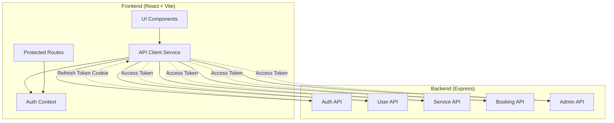
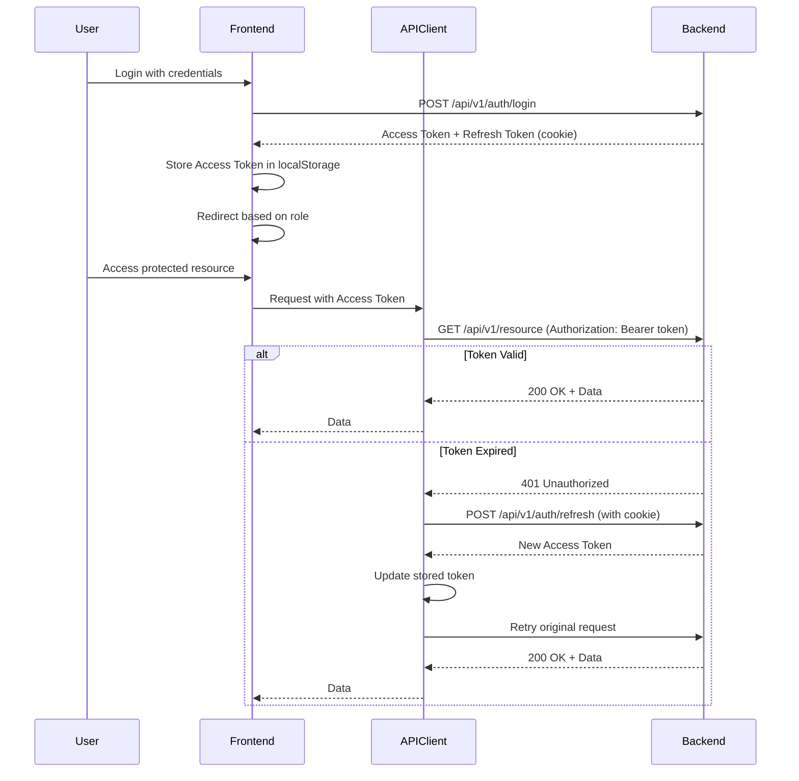

# Design Document: Frontend-Backend Integration

## Overview

This design outlines the integration architecture for connecting the Servify React frontend with the Express.js backend API. The solution implements a centralized API client with automatic token refresh, role-based routing, and comprehensive error handling to provide a seamless user experience across all features.

## Architecture

### High-Level Architecture



### Authentication Flow



## Components and Interfaces

### 1. API Client Service (`client/src/services/api.js`)

The centralized API client handles all HTTP requests with automatic authentication and token refresh.

```javascript
class APIClient {
  constructor(baseURL = '/api/v1') {
    this.baseURL = baseURL;
  }

  // Core request method with token refresh logic
  async request(endpoint, options = {}) {
    const token = this.getAccessToken();
    const headers = {
      'Content-Type': 'application/json',
      ...options.headers,
    };
    
    if (token) {
      headers['Authorization'] = `Bearer ${token}`;
    }

    const config = {
      ...options,
      headers,
      credentials: 'include', // Include cookies for refresh token
    };

    try {
      const response = await fetch(`${this.baseURL}${endpoint}`, config);
      
      // Handle 401 - attempt token refresh
      if (response.status === 401 && !endpoint.includes('/auth/')) {
        const refreshed = await this.refreshToken();
        if (refreshed) {
          // Retry original request with new token
          headers['Authorization'] = `Bearer ${this.getAccessToken()}`;
          return await fetch(`${this.baseURL}${endpoint}`, { ...config, headers });
        } else {
          // Refresh failed - redirect to login
          this.handleAuthFailure();
          throw new Error('Authentication failed');
        }
      }

      return response;
    } catch (error) {
      throw error;
    }
  }

  // HTTP method helpers
  async get(endpoint, options = {}) {
    return this.request(endpoint, { ...options, method: 'GET' });
  }

  async post(endpoint, data, options = {}) {
    return this.request(endpoint, {
      ...options,
      method: 'POST',
      body: JSON.stringify(data),
    });
  }

  async put(endpoint, data, options = {}) {
    return this.request(endpoint, {
      ...options,
      method: 'PUT',
      body: JSON.stringify(data),
    });
  }

  async patch(endpoint, data, options = {}) {
    return this.request(endpoint, {
      ...options,
      method: 'PATCH',
      body: JSON.stringify(data),
    });
  }

  async delete(endpoint, options = {}) {
    return this.request(endpoint, { ...options, method: 'DELETE' });
  }

  // Token management
  getAccessToken() {
    return localStorage.getItem('servify_token');
  }

  setAccessToken(token) {
    localStorage.setItem('servify_token', token);
  }

  async refreshToken() {
    try {
      const response = await fetch(`${this.baseURL}/auth/refresh`, {
        method: 'POST',
        credentials: 'include',
      });

      if (response.ok) {
        const data = await response.json();
        this.setAccessToken(data.accessToken);
        return true;
      }
      return false;
    } catch (error) {
      return false;
    }
  }

  handleAuthFailure() {
    localStorage.removeItem('servify_token');
    localStorage.removeItem('servify_role');
    localStorage.removeItem('servify_email');
    window.location.href = '/login';
  }
}

export default new APIClient();
```

### 2. Auth Service (`client/src/services/authService.js`)

Handles authentication-specific operations.

```javascript
import api from './api';

export const authService = {
  async register(userData) {
    const response = await api.post('/auth/register', userData);
    if (!response.ok) {
      const error = await response.json();
      throw new Error(error.message || 'Registration failed');
    }
    return await response.json();
  },

  async login(credentials) {
    const response = await api.post('/auth/login', credentials);
    if (!response.ok) {
      const error = await response.json();
      throw new Error(error.message || 'Login failed');
    }
    const data = await response.json();
    
    // Store auth data
    api.setAccessToken(data.accessToken);
    localStorage.setItem('servify_role', data.user.user_type);
    localStorage.setItem('servify_email', data.user.email);
    localStorage.setItem('servify_user_id', data.user.id);
    localStorage.setItem('servify_full_name', data.user.full_name);
    
    return data;
  },

  async logout() {
    try {
      await api.post('/auth/logout');
    } finally {
      // Clear local storage regardless of API response
      localStorage.removeItem('servify_token');
      localStorage.removeItem('servify_role');
      localStorage.removeItem('servify_email');
      localStorage.removeItem('servify_user_id');
      localStorage.removeItem('servify_full_name');
    }
  },

  getUser() {
    const role = localStorage.getItem('servify_role');
    const email = localStorage.getItem('servify_email');
    const id = localStorage.getItem('servify_user_id');
    const full_name = localStorage.getItem('servify_full_name');
    
    if (!role) return null;
    return { role, email, id, full_name };
  },

  isAuthenticated() {
    return !!localStorage.getItem('servify_token');
  },
};
```

### 3. Protected Route Component (`client/src/components/ProtectedRoute.jsx`)

Wraps routes that require authentication and role-based access.

```javascript
import { Navigate } from 'react-router-dom';
import { authService } from '../services/authService';

const ROLE_HIERARCHY = {
  admin: 3,
  provider: 2,
  user: 1,
};

const ProtectedRoute = ({ children, requiredRole = null }) => {
  const user = authService.getUser();
  const isAuthenticated = authService.isAuthenticated();

  // Not authenticated - redirect to login
  if (!isAuthenticated || !user) {
    return <Navigate to="/login" replace />;
  }

  // Check role-based access
  if (requiredRole) {
    const userLevel = ROLE_HIERARCHY[user.role] || 0;
    const requiredLevel = ROLE_HIERARCHY[requiredRole] || 0;

    // User doesn't have sufficient role
    if (userLevel < requiredLevel) {
      // Redirect to appropriate dashboard
      const redirectMap = {
        user: '/dashboard',
        provider: '/provider',
        admin: '/admin',
      };
      return <Navigate to={redirectMap[user.role] || '/login'} replace />;
    }
  }

  return children;
};

export default ProtectedRoute;
```

### 4. Service-Specific API Modules

#### User Service (`client/src/services/userService.js`)

```javascript
import api from './api';

export const userService = {
  async getProfile() {
    const response = await api.get('/users/profile');
    if (!response.ok) throw new Error('Failed to fetch profile');
    return await response.json();
  },

  async updateProfile(profileData) {
    const response = await api.put('/users/profile', profileData);
    if (!response.ok) throw new Error('Failed to update profile');
    return await response.json();
  },

  async promoteToProvider() {
    const response = await api.patch('/users/promote');
    if (!response.ok) throw new Error('Failed to promote user');
    return await response.json();
  },
};
```

#### Service Service (`client/src/services/serviceService.js`)

```javascript
import api from './api';

export const serviceService = {
  async getServices(params = {}) {
    const queryString = new URLSearchParams(params).toString();
    const endpoint = queryString ? `/services?${queryString}` : '/services';
    const response = await api.get(endpoint);
    if (!response.ok) throw new Error('Failed to fetch services');
    return await response.json();
  },

  async getServiceById(id) {
    const response = await api.get(`/services/${id}`);
    if (!response.ok) throw new Error('Failed to fetch service');
    return await response.json();
  },

  async createService(serviceData) {
    const response = await api.post('/services/create', serviceData);
    if (!response.ok) throw new Error('Failed to create service');
    return await response.json();
  },

  async updateService(id, serviceData) {
    const response = await api.put(`/services/edit/${id}`, serviceData);
    if (!response.ok) throw new Error('Failed to update service');
    return await response.json();
  },

  async deleteService(id) {
    const response = await api.delete(`/services/${id}`);
    if (!response.ok) throw new Error('Failed to delete service');
    return await response.json();
  },
};
```

#### Booking Service (`client/src/services/bookingService.js`)

```javascript
import api from './api';

export const bookingService = {
  async getAllBookings() {
    const response = await api.get('/bookings');
    if (!response.ok) throw new Error('Failed to fetch bookings');
    return await response.json();
  },

  async createBooking(bookingData) {
    const response = await api.post('/bookings/createBooking', bookingData);
    if (!response.ok) throw new Error('Failed to create booking');
    return await response.json();
  },

  async getClientBookings(clientId) {
    const response = await api.get(`/bookings/client/${clientId}`);
    if (!response.ok) throw new Error('Failed to fetch client bookings');
    return await response.json();
  },

  async getProviderBookings(providerId) {
    const response = await api.get(`/bookings/provider/${providerId}`);
    if (!response.ok) throw new Error('Failed to fetch provider bookings');
    return await response.json();
  },

  async updateBookingStatus(id, status) {
    const response = await api.patch(`/bookings/${id}/status`, { status });
    if (!response.ok) throw new Error('Failed to update booking status');
    return await response.json();
  },

  async deleteBooking(id) {
    const response = await api.delete(`/bookings/${id}`);
    if (!response.ok) throw new Error('Failed to delete booking');
    return await response.json();
  },
};
```

#### Category Service (`client/src/services/categoryService.js`)

```javascript
import api from './api';

export const categoryService = {
  async getAllCategories() {
    const response = await api.get('/categories');
    if (!response.ok) throw new Error('Failed to fetch categories');
    return await response.json();
  },

  async getCategoryById(id) {
    const response = await api.get(`/categories/${id}`);
    if (!response.ok) throw new Error('Failed to fetch category');
    return await response.json();
  },

  async createCategory(categoryData) {
    const response = await api.post('/categories', categoryData);
    if (!response.ok) throw new Error('Failed to create category');
    return await response.json();
  },

  async updateCategory(id, categoryData) {
    const response = await api.put(`/categories/${id}`, categoryData);
    if (!response.ok) throw new Error('Failed to update category');
    return await response.json();
  },

  async deleteCategory(id) {
    const response = await api.delete(`/categories/${id}`);
    if (!response.ok) throw new Error('Failed to delete category');
    return await response.json();
  },
};
```

#### Admin Service (Update existing `client/src/services/adminService.js`)

```javascript
import api from './api';

export const adminService = {
  async getStats() {
    const response = await api.get('/admin/stats');
    if (!response.ok) throw new Error('Failed to fetch admin stats');
    return await response.json();
  },

  async getUsers(params = {}) {
    const queryString = new URLSearchParams(params).toString();
    const endpoint = queryString ? `/admin/users?${queryString}` : '/admin/users';
    const response = await api.get(endpoint);
    if (!response.ok) throw new Error('Failed to fetch users');
    return await response.json();
  },

  async updateUserStatus(userId, status) {
    const response = await api.patch(`/admin/users/${userId}/status`, { status });
    if (!response.ok) throw new Error('Failed to update user status');
    return await response.json();
  },

  async getPendingServices() {
    const response = await api.get('/admin/services/pending');
    if (!response.ok) throw new Error('Failed to fetch pending services');
    return await response.json();
  },

  async approveService(serviceId) {
    const response = await api.patch(`/admin/services/${serviceId}/approve`);
    if (!response.ok) throw new Error('Failed to approve service');
    return await response.json();
  },

  async rejectService(serviceId, reason) {
    const response = await api.patch(`/admin/services/${serviceId}/reject`, { reason });
    if (!response.ok) throw new Error('Failed to reject service');
    return await response.json();
  },

  async getReviews(params = {}) {
    const queryString = new URLSearchParams(params).toString();
    const endpoint = queryString ? `/admin/reviews?${queryString}` : '/admin/reviews';
    const response = await api.get(endpoint);
    if (!response.ok) throw new Error('Failed to fetch reviews');
    return await response.json();
  },

  async moderateReview(reviewId, action) {
    const response = await api.patch(`/admin/reviews/${reviewId}/moderate`, { action });
    if (!response.ok) throw new Error('Failed to moderate review');
    return await response.json();
  },
};
```

### 5. Route Configuration Update (`client/src/App.jsx`)

Update the routing to use ProtectedRoute component:

```javascript
import { BrowserRouter as Router, Routes, Route, Navigate } from 'react-router-dom';
import ProtectedRoute from './components/ProtectedRoute';
import { authService } from './services/authService';

// Import pages
import LandingPage from './pages/LandingPage';
import LoginPage from './pages/LoginPage';
import RegisterPage from './pages/RegisterPage';
import DashboardPage from './pages/Dashboardpage';
import ProviderDashboardPage from './pages/Providerdashboardpage';
import AdminDashboardPage from './pages/AdminDashboardPage';
import ServicesPage from './pages/ServicesPage';

function App() {
  return (
    <Router>
      <Routes>
        {/* Public routes */}
        <Route path="/" element={<LandingPage />} />
        <Route path="/login" element={<LoginPage />} />
        <Route path="/signup" element={<RegisterPage />} />

        {/* Protected routes - User */}
        <Route
          path="/dashboard"
          element={
            <ProtectedRoute requiredRole="user">
              <DashboardPage />
            </ProtectedRoute>
          }
        />
        <Route
          path="/services"
          element={
            <ProtectedRoute requiredRole="user">
              <ServicesPage />
            </ProtectedRoute>
          }
        />

        {/* Protected routes - Provider */}
        <Route
          path="/provider"
          element={
            <ProtectedRoute requiredRole="provider">
              <ProviderDashboardPage />
            </ProtectedRoute>
          }
        />

        {/* Protected routes - Admin */}
        <Route
          path="/admin"
          element={
            <ProtectedRoute requiredRole="admin">
              <AdminDashboardPage />
            </ProtectedRoute>
          }
        />

        {/* Catch all - redirect to appropriate dashboard or landing */}
        <Route
          path="*"
          element={
            authService.isAuthenticated() ? (
              <Navigate to={`/${authService.getUser()?.role === 'admin' ? 'admin' : authService.getUser()?.role === 'provider' ? 'provider' : 'dashboard'}`} replace />
            ) : (
              <Navigate to="/" replace />
            )
          }
        />
      </Routes>
    </Router>
  );
}

export default App;
```

## Data Models

### Frontend Data Models

#### User Model
```typescript
interface User {
  id: number;
  email: string;
  full_name: string;
  user_type: 'user' | 'provider' | 'admin';
  phone_number?: string;
  created_at: string;
}
```

#### Service Model
```typescript
interface Service {
  id: number;
  provider_id: number;
  category_id: number;
  title: string;
  description: string;
  price: number;
  location: string;
  availability: string;
  status: 'pending' | 'approved' | 'rejected';
  created_at: string;
  updated_at: string;
}
```

#### Booking Model
```typescript
interface Booking {
  id: number;
  client_id: number;
  provider_id: number;
  service_id: number;
  booking_date: string;
  status: 'pending' | 'confirmed' | 'completed' | 'cancelled';
  total_price: number;
  created_at: string;
  updated_at: string;
}
```

#### Category Model
```typescript
interface Category {
  id: number;
  name: string;
  description: string;
  icon?: string;
  created_at: string;
}
```

## Correctness Properties

*A property is a characteristic or behavior that should hold true across all valid executions of a system—essentially, a formal statement about what the system should do. Properties serve as the bridge between human-readable specifications and machine-verifiable correctness guarantees.*

### Property 1: Authentication Token Inclusion
*For any* authenticated API request, the request headers should include an Authorization header with the format "Bearer {access_token}".
**Validates: Requirements 1.2**

### Property 2: Token Refresh on 401
*For any* API request that receives a 401 response (excluding auth endpoints), the API client should attempt to refresh the token before failing.
**Validates: Requirements 1.3, 3.1, 9.3**

### Property 3: Successful Token Refresh Retry
*For any* API request that fails with 401 and successfully refreshes the token, the original request should be retried with the new token and the stored access token should be updated.
**Validates: Requirements 1.4, 3.2**

### Property 4: Authentication Failure Redirect
*For any* token refresh failure, the system should clear all authentication state (token, role, email, user_id, full_name) and redirect to the login page.
**Validates: Requirements 1.5, 3.3**

### Property 5: Registration Success Redirect
*For any* successful registration, the user should be redirected to the login page.
**Validates: Requirements 2.2**

### Property 6: Login Success Storage
*For any* successful login, the access token and user information (role, email, user_id, full_name) should be stored in localStorage.
**Validates: Requirements 2.4**

### Property 7: Role-Based Login Redirect
*For any* successful login, the user should be redirected based on their role: 'user' → /dashboard, 'provider' → /provider, 'admin' → /admin.
**Validates: Requirements 2.5**

### Property 8: Logout State Clearing
*For any* logout action, all authentication state (token, role, email, user_id, full_name) should be cleared from localStorage.
**Validates: Requirements 2.6**

### Property 9: Unauthenticated Route Protection
*For any* unauthenticated user attempting to access a protected route, they should be redirected to /login.
**Validates: Requirements 4.1**

### Property 10: Authenticated Route Access
*For any* authenticated user accessing a protected route they have permission for, the requested component should be rendered.
**Validates: Requirements 4.2**

### Property 11: User Role Route Restriction
*For any* authenticated user with role 'user' attempting to access /provider or /admin, they should be redirected to /dashboard.
**Validates: Requirements 4.4**

### Property 12: Provider Role Route Restriction
*For any* authenticated user with role 'provider' attempting to access /admin, they should be redirected to /provider.
**Validates: Requirements 4.5**

### Property 13: Admin Unrestricted Access
*For any* authenticated user with role 'admin', they should have access to all routes without restriction.
**Validates: Requirements 4.6**

### Property 14: Network Error Message Display
*For any* API request that fails with a network error, the message "Unable to connect to server. Please check your connection." should be displayed.
**Validates: Requirements 9.1**

### Property 15: Validation Error Message Display
*For any* API request that fails with a 400 error, the error message from the response body should be displayed to the user.
**Validates: Requirements 9.2**

### Property 16: Forbidden Error Message Display
*For any* API request that fails with a 403 error, the message "You don't have permission to perform this action." should be displayed.
**Validates: Requirements 9.4**

### Property 17: Server Error Message Display
*For any* API request that fails with a 500 error, the message "Server error. Please try again later." should be displayed.
**Validates: Requirements 9.5**

### Property 18: Loading State Management
*For any* API request, a loading indicator should be displayed when the request starts and hidden when it completes (success or failure), and errors should be displayed on failure.
**Validates: Requirements 10.1, 10.2, 10.3**

### Property 19: Duplicate Request Prevention
*For any* API request in progress, subsequent identical requests should be prevented until the first request completes.
**Validates: Requirements 10.4**

## Error Handling

### Error Categories

1. **Network Errors**: Connection failures, timeouts
   - Display: "Unable to connect to server. Please check your connection."
   - Action: Allow retry

2. **Authentication Errors (401)**: Invalid or expired token
   - Action: Attempt token refresh
   - If refresh fails: Clear auth state and redirect to login

3. **Authorization Errors (403)**: Insufficient permissions
   - Display: "You don't have permission to perform this action."
   - Action: No retry, log error

4. **Validation Errors (400)**: Invalid request data
   - Display: Error message from API response
   - Action: Allow user to correct input

5. **Server Errors (500)**: Internal server errors
   - Display: "Server error. Please try again later."
   - Action: Allow retry after delay

### Error Handling Implementation

```javascript
// In API Client
async handleResponse(response) {
  if (!response.ok) {
    const error = await response.json().catch(() => ({}));
    
    switch (response.status) {
      case 400:
        throw new Error(error.message || 'Invalid request');
      case 401:
        // Handled by request method (token refresh)
        throw new Error('Unauthorized');
      case 403:
        throw new Error('You don\'t have permission to perform this action.');
      case 404:
        throw new Error('Resource not found');
      case 500:
        throw new Error('Server error. Please try again later.');
      default:
        throw new Error(error.message || 'An error occurred');
    }
  }
  
  return response.json();
}
```

## Testing Strategy

### Unit Testing

Unit tests will verify specific functionality and edge cases:

1. **API Client Tests**
   - Test token inclusion in headers
   - Test token refresh logic
   - Test error handling for each status code
   - Test request retry after token refresh

2. **Auth Service Tests**
   - Test login with valid credentials
   - Test login with invalid credentials
   - Test registration validation
   - Test logout clears all state

3. **Protected Route Tests**
   - Test redirect for unauthenticated users
   - Test role-based access control
   - Test admin access to all routes

4. **Service Module Tests**
   - Test each service method with mock responses
   - Test error handling in service methods
   - Test query parameter construction

### Property-Based Testing

Property tests will verify universal behaviors across all inputs:

1. **Authentication Properties**
   - Property 1: Token inclusion (test with random endpoints)
   - Property 2: Token refresh on 401 (test with random API calls)
   - Property 8: Logout state clearing (test multiple logout scenarios)

2. **Route Protection Properties**
   - Property 9: Unauthenticated redirect (test with random protected routes)
   - Property 10-12: Role-based access (test with all role combinations)

3. **Error Handling Properties**
   - Property 13-14: Error message display (test with various error responses)
   - Property 15: Loading state management (test with random API calls)

### Integration Testing

Integration tests will verify end-to-end flows:

1. **Authentication Flow**
   - Complete registration → login → access protected resource
   - Login → token expiry → auto-refresh → continue operation
   - Login → logout → verify state cleared

2. **User Dashboard Flow**
   - Login as user → fetch profile → update profile → fetch bookings

3. **Provider Dashboard Flow**
   - Login as provider → fetch services → create service → update service

4. **Admin Dashboard Flow**
   - Login as admin → fetch stats → manage users → moderate services

### Testing Configuration

- **Framework**: Vitest for unit and property tests
- **Property Testing Library**: fast-check
- **Minimum Iterations**: 100 per property test
- **Test Location**: Co-located with source files using `.test.js` suffix
- **Coverage Target**: 80% for critical paths (auth, API client, protected routes)

### Test Tagging

Each property test must include a comment referencing the design property:

```javascript
// Feature: frontend-backend-integration, Property 1: Authentication Token Inclusion
test.prop([fc.string()])('includes auth token in all authenticated requests', async (endpoint) => {
  // Test implementation
});
```
